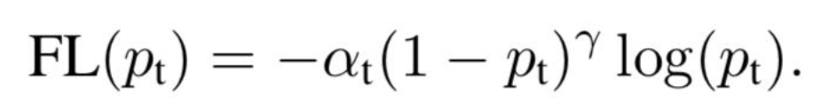

# 中文新闻文本标题分类
## 1. 项目介绍
本项目为新闻标题文本分类 ，需要基于原始新闻标题文本数据训练模型，从而判断其所属类别。

## 2.数据说明
THUCNews是根据新浪新闻RSS订阅频道2005~2011年间的历史数据筛选过滤生成，包含74万篇新闻文档（2.19 GB），均为UTF-8纯文本格式。在原始新浪新闻分类体系的基础上，重新整合划分出14个候选分类类别：财经、彩票、房产、股票、家居、教育、科技、社会、时尚、时政、体育、星座、游戏、娱乐。

训练集总数据量为752471，各类别标签的数据量分布：

{"股票": 138959, "社会": 45765, "财经": 33389, "房产": 18045, "时政": 56778, "科技": 146637, "家居": 29328, "体育": 118440, "时尚": 12032, "游戏": 21936, "娱乐": 83368, "教育": 37743, "彩票": 6830, "星座": 3221}

## 3.baseline
- 我们基于预训练语言模型chinese-roberta-wwm-ext进行文本分类模型的开发。
- 主要训练参数如下(其中batch_size超过4之后会出现过拟合的情况)：
  - 随机种子：1024
  - 学习率：5e-5
  - batch_size：300
  - train_epochs：4
  - max_len：48
  - weight_decay：0.0
- loss：使用交叉熵损失函数CrossEntropyLoss进行损失计算
- 最终在测试集上评测得到的准确率为0.8698669

## 4.使用focal_loss
- 在原始的训练集中，我们可以看到部分类别的数据较少，存在类别不平衡的情况，两两类别间最大的比例可达到1:45
- 在此，我们使用focal_loss来解决标签类别不均衡的情况
- focal_loss的公式为：

- 其中α为给每一个类别设置一个单独的权重，用以控制重点优化那些频率较低的label
- γ则控制降权程度(对简单样本降权)，γ越大，对简单样本的打压越厉害；当γ为0时，退化为交叉熵损失
- 主要训练参数如下：
  - 随机种子：1024
  - 学习率：1e-5
  - batch_size：300
  - train_epochs：10
  - max_len：48
  - weight_decay：0.01
  - focal_loss_gamma：2
  - focal_loss_alpha：对体育、股票、科技标签的alpha权重设置为0.5，其他标签的alpha权重设置为1.0
- 最终在测试集上评测得到的准确率为0.88769

## 5.数据增强
- 除了focal_loss之外，我们还使用第三方包nlpcda，对教育、家居、财经、房产、社会、游戏、彩票、星座、时尚等数据量较少的标签进行数据增强，增强方式为对输入的文本在以下4种方式中进行随机选择增强
  - 随机同义词替换
  - 随机置换邻近的字
  - 翻译互转
  - 使用simbert做生成式相似句生成
- 最终训练集扩充到了998703条数据，各类别标签的数据量分布：
{"时政": 56778, "体育": 118440, "股票": 138959, "科技": 146637, "社会": 49971, "星座": 46458, "房产": 48592, "娱乐": 83368, "时尚": 49176, "教育": 49839, "游戏": 49672, "家居": 49752, "财经": 49870, "彩票": 61191}
- 主要训练参数如下：
  - 随机种子：1024
  - 学习率：1e-5
  - batch_size：300
  - train_epochs：20
  - max_len：48
  - weight_decay：0.01
  - focal_loss_gamma：2
  - focal_loss_alpha：对体育、股票、科技标签的alpha权重设置为0.5，其他标签的alpha权重设置为1.0
- 最终在测试集上评测得到的准确率为0.88769

## 6.基于flask-restful封装预测接口，并使用docker进行部署
- 使用flask-restful框架，对预测服务进行封装，具体见`http`
- 使用docker部署到cpu环境，docker部署脚本见`docker`
- 使用siege进行压测(具体见`tests`)后，每秒qps为15.8/s
